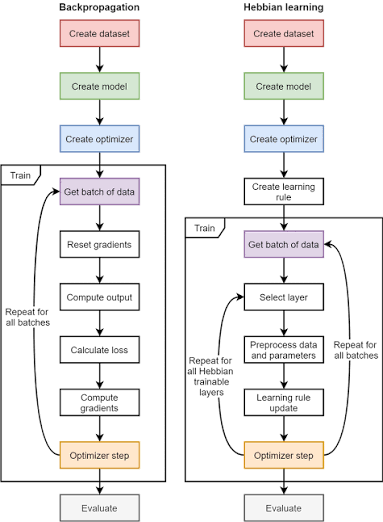
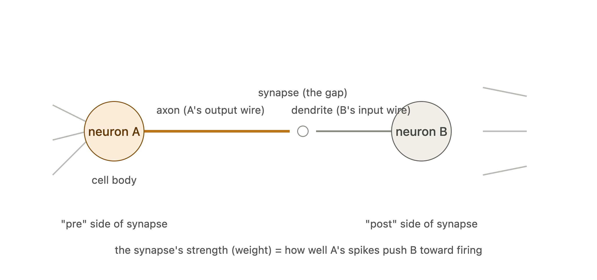

### backprop vs. hebbian learning

### vocab:
neuron: a cell with 
1. an input wire/ dendrites (pre)
2. a body that adds everything (circle)
3. an output wire/axon (post)

spike: a brief electrical pulse the neuron sends down the axon once added up, if the sum crosses the threshold. if not, it doesn't get sent. binary.

synapse: the gap between the axon and dendrite of two neurons
- the thickness of the input/output line (axon/dendrite) = strength of activation

association: 

on STDP: t_pre and t_post are the times that each spike happened at one end of a neuron? where is this measured and is a spike just when the activation increases suddenly? the idea is that if two spikes are close in time, you infer that the first one caused the second one? im confused between neurons, the two ends of a neuron, and spikes. 

why do we overwrite the entire weight matrix with new data every time? and why can we only overwrite 3%? if it was that easy, why haven't we been doing it before?

